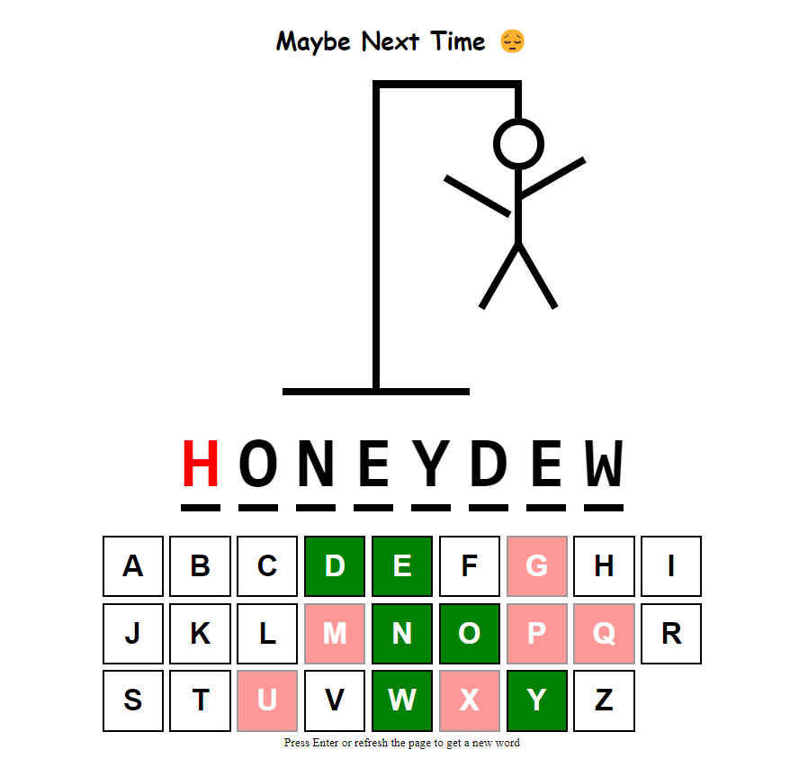

# Guess-word-gallows

Guess-word-gallows is a React (TypeScript) app that revives the classic word-guessing game with a modern touch. Players guess a hidden word one letter at a time, with incorrect guesses tracked in a hangman-style display. Leveraging TypeScript and React, this project showcases my skills in combining game logic with interactive web technologies for a smooth user experience.

## Built with

- [React](https://reactjs.org/)
- [TypeScript](https://www.typescriptlang.org/)
- [Styled Components](https://styled-components.com/)

## How to use the program?

1. Clone the repository: ``` https://github.com/makskhv21/GithubFinder-app.git ```
2. Install dependencies: ``` npm install ```
3. Start the server: ``` npm run dev ```
4. Open a web browser and paste url: ``` http://localhost:5173/ ```


